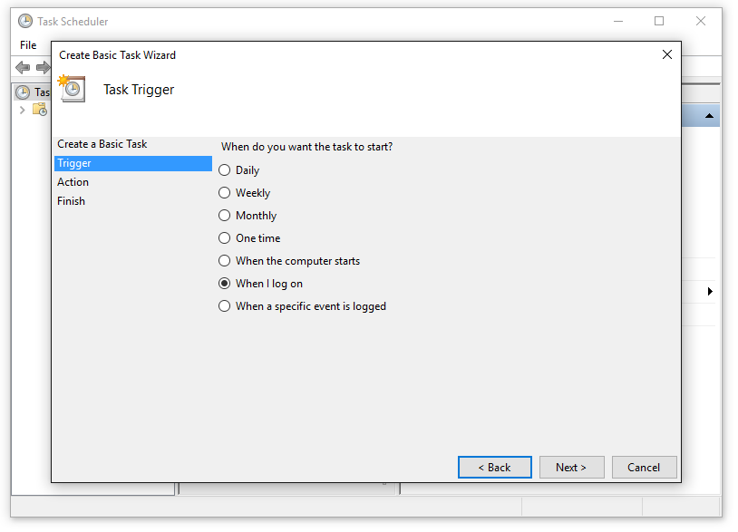

# Daily Wallhaven Wallpaper


**WORK IN PROGRESS!**
*Forked from [Daily Reddit Wallpaper](https://github.com/ssimunic/Daily-Reddit-Wallpaper)*

This script changes your wallpaper to top image of the day on [Wallhaven.cc](https://wallhaven.cc/). More customization will come later on.

**Run it on startup for new wallpaper on every session.**

*Supported: Linux (gnome, kde, mate, lxde), Windows and OS X*

Dependencies
=======
Make sure you have [Python](https://www.python.org/downloads/) installed and PATH variable set.

Ubuntu
------
If you don't have ```pip ``` for Python:
```
sudo apt-get install python-pip
```

You will need modules ```requests``` and ```praw``` installed, which are in requirements.txt:

```
pip install -r requirements.txt
```

Windows
------
Follow [this guide](https://pip.pypa.io/en/stable/installing/) to install  ```pip```  and configure PATH variable.
The rest is the same.

Using script
=======

Simply run:
```
python /path/change_wallpaper_wallhaven.py
```

You can also use newest, hourly, weekly, monthly or yearly wallpaper by adding one of the following arguments: ```new```, ```hour```, ```week```, ```month```, ```year``` to the script.

Example:
```
python /home/silvio/Scripts/change_wallpaper_wallhaven.py --time week
```

NSFW images are disabled by default, to enable them add ```--nsfw```.

On OS X, you can specify display number with option ```--display```. Use 0 for all display (default), 1 for main display and so on.

To change default location where image will be saved, use ```--output folder/subfolder```.

Running on startup
=======
Ubuntu
------
To make managment of the script simple, we can accomplish this using built-in Startup Applications.


Click on Add.


Note: you can use ```--subreddit``` and ```--time``` arguments here aswell.


Windows
------
We will be using Task Scheduler for this. You can find it in Windows search.
Once you open it, click on ```Create Basic Task```
Follow the procedure.





In ```Add arguments``` field type the location of the script. Example

```
"C:\change_wallpaper_haven.py"
```

or

```
"C:\change_wallpaper_haven.py" --time week
```

Running every minute or hour
=======

Look into using cronjobs on Linux or Task Scheduler on Windows for performing this.

Configuration file
=======

Instead of writing arguments every time you run the script, you can also use configuration file which should be located at ```~/.config/change_wallpaper_haven.rc```.

Example of configuration file:

```
time=day
```
