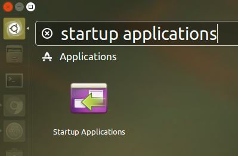

# Daily Wallhaven Wallpaper


*Forked from [Daily Reddit Wallpaper](https://github.com/ssimunic/Daily-Reddit-Wallpaper)*

This script changes your wallpaper to top image of the day on [Wallhaven.cc](https://wallhaven.cc/).

**Run it on startup for new wallpaper on every session.**

*Supported: Linux (gnome, kde, mate, lxde), Windows and OS X with Python 2 and 3*

Dependencies
=======
Make sure you have [Python](https://www.python.org/downloads/) installed and PATH variable set.

Ubuntu
------
If you don't have ```pip ``` for Python:
```
sudo apt-get install python-pip
```

You will need modules ```requests``` and ```praw``` installed, which are in requirements.txt:

```
pip install -r requirements.txt
```

Windows
------
Follow [this guide](https://pip.pypa.io/en/stable/installing/) to install  ```pip```  and configure PATH variable.
The rest is the same.

Using script
=======

Simply run:
```
python /path_to_file/change_wallpaper_wallhaven.py
```

There are few optional parameters than you can visualize by typing

```
python /path_to_file/change_wallpaper_wallhaven.py -h
```

After running the script once, a file called `change_wallpaper_haven.rc` will be created in the same directory has the python file. You can customize all the settings here. Use the command above option to see all the valid parameters.

The files are automatically saved to `~/Pictures/Wallpapers`. You can also change that in the config file (or by using the `-o` parameter).

Running on startup
=======
**Warning!** The screenshots shown here are from the main github repository that was designed to get a daily picture from Reddit, and not from Wallhaven. Just replace `reddit` by `wallhaven` and you're all set.


Ubuntu
------


To make managment of the script simple, we can accomplish this using built-in Startup Applications.



Click on Add.


Note: you can use arguments here aswell.


Windows
------
We will be using Task Scheduler for this. You can find it in Windows search.
Once you open it, click on ```Create Basic Task```
Follow the procedure.


In `Add arguments` field type the location of the script. Example

```
"C:\change_wallpaper_haven.py"
```

or even with parameters

```
"C:\change_wallpaper_haven.py" --sorting toplist --toprange 3d
```

Running every minute or hour
=======

Look into using cronjobs on Linux or Task Scheduler on Windows for performing this.

Configuration file
=======

Instead of writing arguments every time you run the script, you can also use configuration file which should be located in the same diretory as the python file `./change_wallpaper_haven.rc`. **You need to run the script at least once for the config file to be created**

Example of configuration file:

```
[DEFAULT]
apikey = 
sorting = toplist
toprange = 1d
order = desc
atleast = 1920x1080
categories = 100
purity = 100
display = 0
output = ~/Pictures/Wallpapers
```

**Note:** You need to provide an API key to enable NSFW wallpapers.